# ProofsyGPU - GPU Job Receipt Tracker

## 🎯 Overview

**ProofsyGPU** is a serverless GPU job receipt tracking system that logs compute job lifecycles (JobSubmitted → JobCompleted) as ERC-7053 commit events to Numbers Mainnet blockchain. Built with Vercel serverless functions and provides a compact audit UI for transparent GPU usage accountability.

## ✨ Key Features

- **Blockchain Job Receipts**: Every GPU job logged to Numbers Mainnet with ERC-7053 standard
- **Serverless Architecture**: Vercel serverless functions with auto-scaling
- **Mock GPU Simulator**: Realistic job simulation without requiring real GPU hardware
- **Audit UI**: Query job timeline by NID with complete blockchain proof
- **5 Task Types**: Stable Diffusion, LLM Inference, Model Training, Video Upscaling, Speech-to-Text
- **Idempotency**: Prevents duplicate event processing
- **Real-time Status**: System health monitoring and job tracking

## 🏗️ Architecture

### System Architecture Diagram

```mermaid
graph TB
    subgraph "Frontend - Static HTML/JS"
        UI[Web Interface]
        JobForm[Job Submission Form]
        Timeline[Audit Timeline UI]
        JobList[Jobs Dashboard]
    end
    
    subgraph "Vercel Serverless Functions"
        SubmitAPI[/api/jobs/submit.js]
        CompleteAPI[/api/jobs/complete.js]
        TimelineAPI[/api/jobs/timeline/jobId.js]
        ListAPI[/api/jobs/list.js]
        HealthAPI[/api/health.js]
    end
    
    subgraph "Mock GPU Layer"
        Simulator[GPU Job Simulator]
        TaskTypes[5 Task Types]
        ArtifactGen[Artifact Generator]
    end
    
    subgraph "Data Layer"
        Prisma[Prisma ORM]
        VercelDB[(Vercel Postgres)]
    end
    
    subgraph "Blockchain Layer"
        Numbers[Numbers Protocol<br/>Capture API]
        Mainnet[Numbers Mainnet<br/>ERC-7053]
        Explorer[Blockchain Explorer]
    end
    
    UI --> JobForm
    UI --> Timeline
    UI --> JobList
    
    JobForm -->|POST| SubmitAPI
    Timeline -->|GET| TimelineAPI
    JobList -->|GET| ListAPI
    
    SubmitAPI --> Simulator
    CompleteAPI --> Simulator
    
    Simulator --> TaskTypes
    Simulator --> ArtifactGen
    
    SubmitAPI -->|Commit Receipt| Numbers
    CompleteAPI -->|Commit Receipt| Numbers
    
    SubmitAPI -->|Save| Prisma
    CompleteAPI -->|Save| Prisma
    TimelineAPI -->|Query| Prisma
    
    Prisma --> VercelDB
    
    Numbers -->|ERC-7053| Mainnet
    Mainnet -->|NID + TxHash| Numbers
    
    Timeline -->|Verify| Explorer
    
    style UI fill:#e1f5ff
    style SubmitAPI fill:#fff4e1
    style Simulator fill:#f0e1ff
    style VercelDB fill:#e1ffe1
    style Mainnet fill:#ffe1e1
```

### Job Lifecycle Flow

```mermaid
sequenceDiagram
    participant User
    participant Frontend
    participant SubmitAPI as /api/jobs/submit
    participant Simulator as GPU Simulator
    participant Numbers as Numbers API
    participant Blockchain as Numbers Mainnet
    participant DB as Vercel Postgres
    participant CompleteAPI as /api/jobs/complete
    participant Explorer
    
    User->>Frontend: 1. Select Task Type<br/>(Stable Diffusion, etc.)
    Frontend->>SubmitAPI: 2. POST /api/jobs/submit<br/>{taskType, executor}
    
    SubmitAPI->>Simulator: 3. Generate Job Data
    Simulator-->>SubmitAPI: jobId, gpuType, inputHash
    
    SubmitAPI->>Numbers: 4. Commit JobSubmitted<br/>(ERC-7053)
    Numbers->>Blockchain: 5. Write to Mainnet
    Blockchain-->>Numbers: 6. Return NID + TxHash
    Numbers-->>SubmitAPI: Receipt
    
    SubmitAPI->>DB: 7. Save JobReceipt<br/>(idempotencyKey)
    DB-->>SubmitAPI: ✅ Stored
    
    SubmitAPI-->>Frontend: 8. Success + NID
    Frontend-->>User: 9. Job Submitted ✓
    
    Note over Frontend,CompleteAPI: Auto-complete after 3s (optional)
    
    Frontend->>CompleteAPI: 10. POST /api/jobs/complete<br/>{jobId}
    CompleteAPI->>Simulator: 11. Generate Output
    Simulator-->>CompleteAPI: outputHash, duration, gpuUtilization
    
    CompleteAPI->>Numbers: 12. Commit JobCompleted<br/>(ERC-7053)
    Numbers->>Blockchain: 13. Write to Mainnet
    Blockchain-->>Numbers: 14. Return NID + TxHash
    
    CompleteAPI->>DB: 15. Save Completion Receipt
    CompleteAPI-->>Frontend: 16. Success + Receipt
    
    User->>Frontend: 17. View Timeline
    Frontend->>Explorer: 18. Verify on Blockchain
    Explorer-->>User: 19. Show Proof ✅
```



## 📋 Event Schema

### JobSubmitted Event
```json
{
  "eventType": "JobSubmitted",
  "jobId": "job_1729012345_abc123",
  "taskType": "stable-diffusion",
  "executor": "0x51130dB91B91377A24d6Ebeb2a5fC02748b53ce1",
  "occurredAt": "2025-10-15T10:00:00Z",
  "idempotencyKey": "gpu-job-job_1729012345_abc123-JobSubmitted",
  "metadata": {
    "jobId": "job_1729012345_abc123",
    "taskType": "stable-diffusion",
    "taskName": "Stable Diffusion Image Generation",
    "gpuType": "NVIDIA A100 80GB",
    "estimatedDuration": 45,
    "inputHash": "QmInputAbc123...",
    "executor": "0x51130dB91B91377A24d6Ebeb2a5fC02748b53ce1",
    "status": "submitted"
  }
}
```

### JobCompleted Event
```json
{
  "eventType": "JobCompleted",
  "jobId": "job_1729012345_abc123",
  "taskType": "stable-diffusion",
  "executor": "0x51130dB91B91377A24d6Ebeb2a5fC02748b53ce1",
  "occurredAt": "2025-10-15T10:00:52Z",
  "idempotencyKey": "gpu-job-job_1729012345_abc123-JobCompleted",
  "metadata": {
    "jobId": "job_1729012345_abc123",
    "taskType": "stable-diffusion",
    "taskName": "Stable Diffusion Image Generation",
    "gpuType": "NVIDIA A100 80GB",
    "executor": "0x51130dB91B91377A24d6Ebeb2a5fC02748b53ce1",
    "outputHash": "QmOutputDef456...",
    "outputCid": "bafybeigabc123...",
    "duration": 52.3,
    "gpuUtilization": "87%",
    "exitCode": 0,
    "status": "completed",
    "artifact": {
      "fileName": "job_1729012345_abc123_output.png",
      "fileHash": "sha256:abc123...",
      "fileSize": 2048000,
      "mimeType": "image/png"
    }
  }
}
```

### Blockchain Storage Schema
```json
{
  "assetCid": "bafkrei...",
  "assetSha256": "proof_hash_from_numbers_api",
  "encodingFormat": "application/json",
  "assetTimestampCreated": 1760615889,
  "assetCreator": "creator_name",
  "abstract": "GPU Job JobSubmitted: taskType | JobID: jobId | GPU: gpuType | Executor: executor",
  "headline": "ProofsyGPU - taskType Job Receipt",
  "assetSourceType": "others",
  "creatorWallet": "0x...",
  "jobDetails": {
    "eventType": "JobSubmitted|JobCompleted",
    "jobId": "job_id",
    "taskType": "task_type",
    "executor": "0x...",
    "occurredAt": "ISO_timestamp",
    "idempotencyKey": "gpu-job-jobId-eventType"
  },
  "gpuJobMetadata": {
    "jobId": "job_id",
    "taskType": "task_type",
    "taskName": "Human Readable Task Name",
    "gpuType": "NVIDIA A100 80GB",
    "executor": "0x...",
    "status": "submitted|completed",
    "inputHash": "QmInput...",
    "estimatedDuration": 45,
    "outputHash": "QmOutput...",
    "duration": 52.3,
    "gpuUtilization": "87%",
    "artifact": { "fileName": "...", "fileHash": "...", "fileSize": 1234, "mimeType": "..." }
  }
}
```

## 🚀 Quick Start

### Prerequisites
- Node.js 18+
- Vercel account
- Numbers Protocol API Key

### Local Development

1. **Clone Repository**
```bash
git clone https://github.com/yourusername/proofsy-gpu.git
cd proofsy-gpu
```

2. **Install Dependencies**
```bash
npm install
```

3. **Configure Environment**
```bash
cp .env.example .env
# Edit .env with your Numbers Protocol API key
```

4. **Setup Database**
```bash
npx prisma migrate dev
```

5. **Start Development Server**
```bash
npm run dev
```

6. **Access Application**
Open browser: `http://localhost:3000`

---

## 🚀 Vercel Deployment

### One-Click Deploy

[](https://vercel.com/new/clone?repository-url=https://github.com/yourusername/proofsy-gpu)

### Manual Deployment

1. **Install Vercel CLI**
```bash
npm i -g vercel
```

2. **Login to Vercel**
```bash
vercel login
```

3. **Deploy**
```bash
vercel --prod
```

4. **Add Vercel Postgres Database**
   - Go to Vercel Dashboard → Storage → Create Database
   - Select PostgreSQL
   - Auto-links to your project
   - Vercel auto-injects `POSTGRES_PRISMA_URL` and other DB variables

5. **Configure Environment Variables in Vercel Dashboard**
   - `NUMBERS_API_KEY` - Your Numbers Protocol API key
   - Database URLs are auto-configured by Vercel Postgres

6. **Run Database Migrations**
   - Migrations run automatically on first deploy via `npm run build`
   - Or manually: `vercel env pull .env.local && npx prisma migrate deploy`

---

## 🎮 Mock GPU Simulator

### Supported Task Types

1. **Stable Diffusion Image Generation**
   - Simulated duration: ~45s
   - Output: PNG image (mock)

2. **LLM Text Inference**
   - Simulated duration: ~12s
   - Output: JSON response (mock)

3. **Model Fine-tuning**
   - Simulated duration: ~300s
   - Output: .pt model file (mock)

4. **AI Video Upscaling**
   - Simulated duration: ~180s
   - Output: MP4 video (mock)

5. **Speech-to-Text Transcription**
   - Simulated duration: ~30s
   - Output: JSON transcript (mock)

### GPU Types (Simulated)
- NVIDIA A100 80GB
- NVIDIA H100 SXM
- NVIDIA RTX 4090
- AMD MI300X
- Google TPU v5e

### Realistic Metrics
- GPU Utilization: 70-95% (randomized)
- Duration: ±20% variance from estimated
- Exit codes, output hashes, CIDs

---

## 🔧 API Endpoints

### Health Check
```http
GET /api/health
```

### Submit Job
```http
POST /api/jobs/submit
Content-Type: application/json

{
  "taskType": "stable-diffusion",
  "executor": "0x..."
}
```

### Complete Job
```http
POST /api/jobs/complete
Content-Type: application/json

{
  "jobId": "job_...",
  "taskType": "stable-diffusion",
  "estimatedDuration": 45,
  "executor": "0x..."
}
```

### Get Job Timeline
```http
GET /api/jobs/timeline/{jobId}
```

### List All Jobs
```http
GET /api/jobs/list
```

---

## 🔍 Ordering & Idempotency

### Idempotency Strategy
- **Deterministic Keys**: Each event has `idempotencyKey`: `gpu-job-{jobId}-{eventType}` (no timestamp)
- **Duplicate Prevention**: Database enforces uniqueness via `@@unique` constraint
- **Retry Handling**: API returns `409 Conflict` if same job+event submitted twice
- **Example**: 
  - `gpu-job-job_123_abc-JobSubmitted` (first submit = success)
  - `gpu-job-job_123_abc-JobSubmitted` (retry = 409 Conflict)
  - `gpu-job-job_123_abc-JobCompleted` (different event = success)

### Ordering Strategy
- Events ordered by `occurredAt` timestamp
- Timeline query sorts chronologically (oldest first)
- JobSubmitted always precedes JobCompleted for same jobId
- Deterministic keys ensure exactly-once semantics per job lifecycle stage

### Local Job States → Blockchain Payloads Mapping


### Job State Transitions
1. **Job Submitted** → **JobSubmitted Event** → **Numbers Protocol Asset**
2. **Job Completed** → **JobCompleted Event** → **Numbers Protocol Asset**
3. **Each Event** → **Unique Blockchain Receipt** (NID + Proof Hash)
4. **Timeline Query** → **Chronological Event Chain** → **Complete Audit Trail**

---

## 🔐 Blockchain Verification

Every job receipt includes:
- **NID**: Asset identifier on Numbers Mainnet
- **Transaction Hash**: Blockchain transaction ID
- **Explorer Link**: Direct link to verify on Numbers Protocol Explorer
- **Metadata**: Complete job details stored on-chain

**Verify Job:**
1. Click "View Timeline" on any job
2. Click "Verify on Blockchain" button
3. See complete on-chain proof at verify.numbersprotocol.io

---

## 📊 Database Schema

```prisma
model JobReceipt {
  id              String   @id @default(cuid())
  idempotencyKey  String   @unique
  jobId           String
  eventType       String   // "JobSubmitted" or "JobCompleted"
  taskType        String
  executor        String
  occurredAt      DateTime
  metadataJson    String
  inputHash       String?
  outputHash      String?
  gpuType         String?
  duration        Float?
  gpuUtilization  String?
  txHash          String
  nid             String
  chain           String   @default("numbers-mainnet")
  createdAt       DateTime @default(now())
  
  @@index([jobId])
  @@index([nid])
}
```

---

## 📝 License

MIT License

---

## 🤝 Contributing

1. Fork the repository
2. Create feature branch
3. Commit changes
4. Push to branch
5. Create Pull Request

---

## 📞 Support

- Documentation: [Numbers Protocol Docs](https://docs.numbersprotocol.io/)
- API Reference: [Capture API](https://docs.numbersprotocol.io/capture-api)
- Vercel Docs: [Vercel Platform](https://vercel.com/docs)

---

**ProofsyGPU - Transparent GPU Job Tracking on Numbers Mainnet** ⚡
